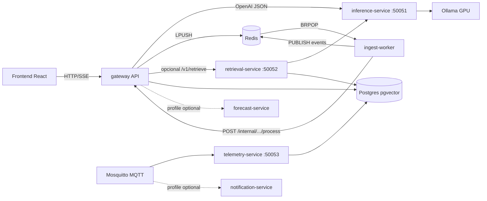

# Arquitectura microservicios AgroPS (TFM)

Arquitectura objetivo **realista**: el gateway FastAPI orquesta; GPU, cola de ingesta, telemetría IoT y retrieval denso viven en servicios aparte.

## Diagrama



## Servicios (por retorno TFM)

| Servicio | Puerto | Protocolo | Rol |
|---|---|---|---|
| **inference-service** | 50051 | HTTP JSON ≈ gRPC (`protos/inference.proto`) | Embeddings + chat; aísla Ollama/GPU |
| **ingest-worker** | — | Redis cola `ingest:jobs` | PDF→chunk→embed vía API interna; eventos `ingest:events` |
| **telemetry-service** | 50053 | MQTT → Postgres | `finca/{id}/riego`, `reefer/{id}/temp` → `sensor_readings` |
| **retrieval-service** | 50052 | HTTP ≈ gRPC (`protos/retrieval.proto`) | Dense pgvector (mismo retrieval para Hybrid/Agentic/eval) |
| forecast-service | 50054 | HTTP | Opcional (`--profile optional`): proxy a Prophet/ARIMAX del gateway |
| notification-service | 50055 | MQTT | Opcional: umbrales caudal/temp |

## Contratos

- `protos/inference.proto` — `Embed` / `Generate`
- `protos/retrieval.proto` — `Retrieve`
- Implementación pragmática: **HTTP JSON** (compatible OpenAI SDK / httpx). Los `.proto` documentan el contrato de tesis.

## Flags del gateway

| Env | Default | Efecto |
|---|---|---|
| `INFERENCE_URL` | `http://inference:50051` | LLM/embeddings vía inference |
| `USE_INGEST_QUEUE` | `true` | Upload encola Redis; si falla → `BackgroundTasks` |
| `USE_RETRIEVAL_SERVICE` | `false` | Dense remoto; BM25+RRF siguen en gateway |
| `RETRIEVAL_URL` | `http://retrieval:50052` | Cliente retrieval |
| `REDIS_URL` | `redis://redis:6379/0` | Cola + pub/sub |
| `INTERNAL_SERVICE_TOKEN` | `agrops-internal` | Auth worker → `/api/v1/internal/*` |

## Arranque

```bash
# Stack completo (recomendado TFM)
docker compose up -d --build

# + opcionales
docker compose --profile optional up -d --build

# Publicar telemetría de prueba
mosquitto_pub -h localhost -t 'finca/demo/riego' -m '{"caudal":0.05,"unit":"l/s"}'
mosquitto_pub -h localhost -t 'reefer/R1/temp' -m '{"temp":9.2,"unit":"C"}'
```

## Flujo de ingesta

1. `POST /api/v1/documents` guarda fichero + `ProcessingJob` y hace `LPUSH ingest:jobs`.
2. `ingest-worker` hace `BRPOP` y llama `POST /api/v1/internal/documents/{id}/process`.
3. El pipeline existente (`IngestService`) corre en el API (acceso a storage/Docling).
4. Worker publica `ingest.started|completed|failed` en Redis; SSE en `/api/v1/internal/ingest/events`.

## Qué queda en el monolito (a propósito)

- Auth, multitenant, chat Hybrid/Agentic, BM25+RRF, eval, CRUD fincas.
- El worker **reutiliza** `IngestService` vía endpoint interno (sin duplicar Docling/Whisper).

## Migración

- `postgres/migrations/007_sensor_readings.sql` — tabla IoT.
